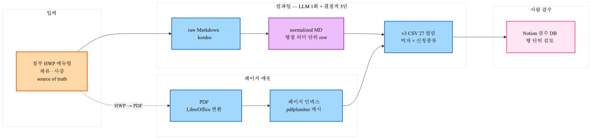
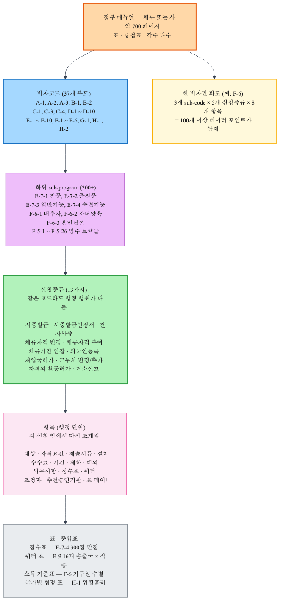
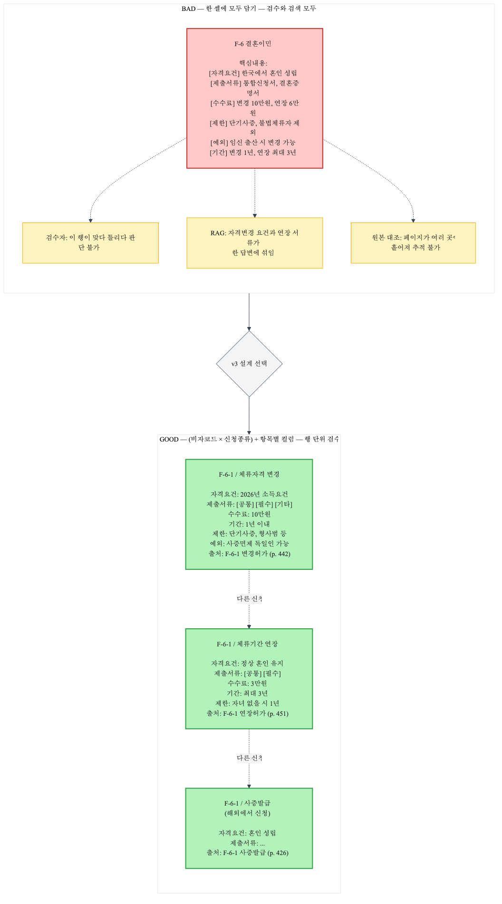
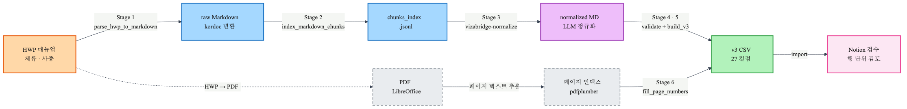
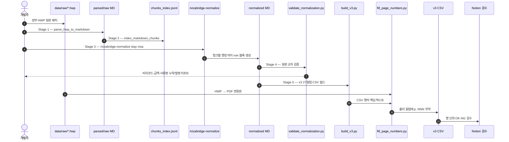
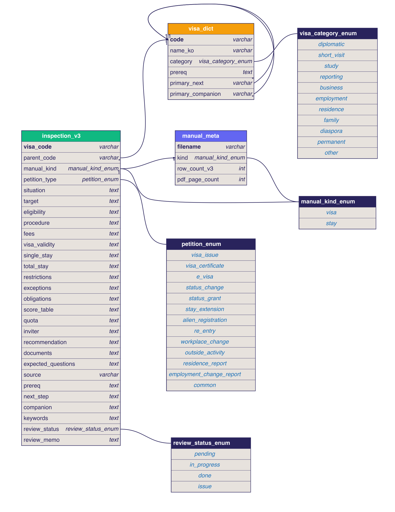

<div align="center">

# Vizabridge

**한국 비자·체류 매뉴얼을 검수 가능한 데이터로 컴파일하는 파이프라인**

[]()
[]()
[]()
[]()
[]()
[]()

[한국어](README.md) · [English](README_EN.md)

</div>

---

## 한 줄 정의

> 700 페이지짜리 정부 HWP 매뉴얼을, **검수자가 행 단위로 OK·NG 판단할 수 있는 27컬럼 CSV** 로 컴파일한다.



---

## 왜 만들었나

비자 매뉴얼은 **문서가 아니라 행정 규칙 데이터베이스**다. 700 페이지짜리 PDF를 그대로 RAG에 넣으면:

- 검수자가 한 답변이 "정확한가" 판단할 기준이 없다.
- 자격 변경 요건과 기간 연장 서류가 한 답변에 섞여 나온다.
- 페이지 출처를 모르면 사용자가 원본을 확인할 수 없다.
- 매뉴얼이 개정될 때마다 임베딩을 다시 만들어야 한다.

그래서 **임베딩 전에 한 번 컴파일**한다. 비자코드·신청종류·자격요건·제출서류·제한·예외·출처 페이지를 각자 컬럼으로 분리한 CSV를 만들고, 사람이 검수한 뒤에야 챗봇/RAG로 넘긴다.

---

## 한국 비자 매뉴얼의 구조

매뉴얼은 평평한 텍스트가 아니다. 5층 트리에 가깝다.



> **F-6 결혼이민 하나만 봐도** 3개 sub-code × 5개 신청종류 × 8개 항목 = 100+ 데이터 포인트가 흩어져 있다.

---

## 행 설계 — Bad vs Good

가장 큰 설계 결정은 "한 행이 무엇인가" 였다.



| 모델 | 행 단위 | 한 행의 셀 길이 | 검수 가능성 |
| --- | --- | --- | --- |
| ❌ Bad | 비자코드 1개 | 5,000자 이상 | 불가능 — 사증발급/자격변경/기간연장이 한 셀에 섞임 |
| ✅ Good (v3) | (비자코드 × 신청종류) | 항목별 컬럼으로 분리 | 행 단위 OK·NG 즉시 판정 |

---

## 30초 요약

| 항목 | 내용 |
| --- | --- |
| 원본 | `data/raw/*.hwp` |
| 중간 표현 | `data/parsed/normalized/{stay,visa}_manual.md` |
| 최종 산출물 | `data/processed/{체류,사증}매뉴얼_검수용_v3.csv` |
| 행 단위 | `(비자코드 × 신청종류)` |
| 스키마 | 27컬럼 |
| LLM 호출 | Stage 3 정규화 1회 |
| 결정적 처리 | HWP 변환, 청크 분할, 검증, CSV 빌드, 페이지 매핑 |
| 현재 행 수 | 체류 233행, 사증 130행 |
| 페이지 매핑 | 100% (모든 행의 `출처`에 `p. NNN`) |

---

## 파이프라인

> **핵심 원칙: LLM은 의미 정규화만 담당하고, 나머지 5단계는 결정적 Python으로 재현 가능하게 한다.**



### 단계별 책임

| Stage | 처리 | 도구 | 입력 | 출력 |
| --- | --- | --- | --- | --- |
| 1 | HWP → Markdown | `scripts/parse_hwp_to_markdown.py`, kordoc | `data/raw/*.hwp` | `data/parsed/raw/*.md` |
| 2 | 표 경계 기준 청크 분할 | `scripts/index_markdown_chunks.py` | raw Markdown | `data/parsed/chunks/*.jsonl` |
| 3 | 행정 의미 단위 정규화 | `/vizabridge-normalize` Claude Code 스킬 | chunks | `data/parsed/normalized/*.md` |
| 4 | 원본 대조 검증 | `scripts/validate_normalization.py` | normalized + raw | `data/parsed/validation/*.json` |
| 5 | v3 CSV 빌드 | `scripts/build_v3.py` | normalized MD | `data/processed/*_검수용_v3.csv` |
| 6 | PDF 페이지 fuzzy 매칭 | `scripts/fill_page_numbers.py` | v3 CSV + PDF | 출처 페이지 보강 CSV |

### 시퀀스 (개발자 시점)



---

## v3 스키마 (27컬럼)



스키마 원본은 [`docs/diagrams/v3_schema.dbml`](docs/diagrams/v3_schema.dbml). dbdiagram.io 에 그대로 붙여넣으면 인터랙티브 ERD 를 볼 수 있다.

| 그룹 | 개수 | 컬럼 |
| --- | ---: | --- |
| 식별·분류 | 4 | `비자코드`, `상위코드`, `사증·체류`, `신청종류` |
| 행정 내용 | 14 | `신청상황`, `대상자`, `자격요건`, `절차`, `수수료`, `기간`, `제한`, `예외`, `의무사항`, `점수표`, `쿼터`, `초청자`, `추천·승인기관`, `표 데이터` |
| 자료 | 2 | `제출서류`, `예상질문` |
| 출처 | 1 | `출처` (섹션 + 페이지) |
| 흐름·검색 | 4 | `선행자격`, `다음단계`, `동반가족`, `키워드` |
| 검수 | 2 | `검수상태`, `검수메모` |

### 컬럼을 이렇게 나눈 이유

| 설계 결정 | 이유 |
| --- | --- |
| 행 = `(비자코드 × 신청종류)` | 사증발급·자격변경·기간연장은 요건과 서류가 달라 — 한 행으로 합치면 검수가 안 된다. |
| `자격요건`, `제한`, `예외` 분리 | RAG 답변에서 "할 수 있음/없음"과 "필수/예외"가 섞이는 사고를 막는다. |
| `출처`에 페이지 포함 | 검수자는 한 컬럼만 보고 원본 PDF·HWP로 바로 점프한다. |
| `선행자격`, `다음단계`, `동반가족` | 사용자는 비자코드를 모르고 "결혼 후 영주는?" 처럼 묻기 때문에 흐름을 미리 부착한다. |
| `검수상태`, `검수메모` | Notion 으로 import 만 하면 검수 워크플로가 즉시 시작된다. |

---

## 빠른 시작

### 환경

```bash
python3 -m venv .venv
source .venv/bin/activate
pip install -r requirements.txt
node --version    # kordoc 용 Node.js 18+
```

### 새 매뉴얼 처음부터 처리

```bash
# Stage 1·2 — HWP → Markdown → chunks
python scripts/parse_hwp_to_markdown.py
python scripts/index_markdown_chunks.py

# Stage 3 — Claude Code 세션에서
#   /vizabridge-normalize stay
#   /vizabridge-normalize visa

# Stage 4·5 — 검증 + v3 CSV
python scripts/validate_normalization.py
python scripts/build_v3.py

# Stage 6 — HWP → PDF → 페이지 매핑
brew install --cask libreoffice
curl -L -o /tmp/H2Orestart.oxt \
  https://github.com/ebandal/H2Orestart/releases/latest/download/H2Orestart.oxt
unopkg add /tmp/H2Orestart.oxt
soffice --headless --convert-to pdf --outdir data/raw/pdf/ data/raw/*.hwp
python scripts/fill_page_numbers.py
```

### 페이지 매칭만 다시

```bash
python scripts/fill_page_numbers.py both --force
```

### 재실행 매트릭스

| 무엇이 바뀌었나 | 다시 실행 |
| --- | --- |
| HWP 원본 | 1 → 6 (전체) |
| 정규화 규칙 | 3 → 6 |
| v3 컬럼 매핑 | 5 → 6 |
| 페이지 번호만 어긋남 | 6 |
| 검수자가 오타 발견 | normalized MD 또는 빌더 규칙 수정 후 4 → 6 |

정규화 MD 를 git 에 커밋하는 이유가 여기다 — **CSV 컬럼이나 페이지 매핑을 바꿀 때 LLM 을 다시 부르지 않아도 된다.**

---

## 페이지 매핑 기술 상세

HWP 본문은 source of truth, 페이지 번호는 검수 편의를 위해 PDF 변환본에서 가져온다.

```
HWP  →  PDF  →  pdfplumber  →  페이지 텍스트 인덱스  →  fuzzy 매칭  →  출처 컬럼
       (LibreOffice               (캐시)                 (sliding
        + H2Orestart)                                     window)
```

### 매칭 알고리즘

1. **PDF 페이지별 텍스트 추출** — `pdfplumber`, JSON 캐시 (`data/raw/pdf/.cache/`)
2. **정규화 3단계**
   - `unicodedata.normalize("NFC", s)` — 자모 합성
   - 구두점·공백·괄호 제거
   - **`([가-힣])\1+ → \1` 한글 중복 글자 압축** ← LibreOffice + H2Orestart 변환 시 한글이 중복 출력되는 버그 보정. 이게 매칭률을 5%→100% 로 끌어올림.
3. **Sliding window** — 50자 → 30자 → 18자 차차 시도, step 8자
4. **점수 투표** — 같은 페이지에 여러 윈도우 매칭되면 점수 누적
5. **Hint 가중치** — 직전 행 페이지 ±8쪽 이내 2.5배 가산, 60쪽+ 떨어지면 0.15배 페널티 (boilerplate 오매칭 회피)
6. **Fallback** — 출처 라벨 → hint 페이지 → 빈값
7. **인접 페이지 그룹** — 한 (비자, 신청) 묶음이 여러 페이지에 걸치면 `p. 442~444`

### 매칭 결과

| 매뉴얼 | 행 수 | 페이지 매칭 |
| --- | ---: | ---: |
| 체류 | 233 | **100%** |
| 사증 | 130 | **100%** |

---

## 검수 워크플로 (Notion)

1. `data/processed/체류매뉴얼_노션검수용_v3.csv` 또는 `사증매뉴얼_노션검수용_v3.csv` 다운로드
2. Notion 에서 `+` → **Import** → CSV 선택
3. 컬럼 type 전환
   - `검수상태` → Status
   - `사증·체류`, `신청종류`, `상위코드` → Select
4. 뷰 추가 — 필터 `검수상태 = 미검수`, 정렬 `상위코드`
5. 각 행의 `출처` 컬럼 (`F-6-1 변경허가 (p. 442)`) → 원본 PDF·HWP 점프
6. 검수 완료 시 `검수상태` `검수메모` 갱신

---

## 데이터 품질 보증

```bash
python -m pytest tests -q
```

다음을 회귀로 잠근다:

- 정규화 row 의 비자코드·금액·서류명이 원본 청크에 실제 등장
- 모든 v3 행에 출처 페이지 채움
- 핵심 사실 8건 — F-6 2026 소득요건, E-7-4 200점/2,600만원, D-2-5 2년 초과 불가, F-5-1 5년 체류, F-2-7 80점, E-9 16개 송출국, H-1 만 18~30세, F-4 단순노무 제한
- Notion 호환 컬럼 type 구조 유지

---

## 디렉토리 구조

```text
.
├── data/
│   ├── raw/                       # HWP 원본, PDF 변환물 (gitignored)
│   ├── parsed/
│   │   ├── raw/                   # kordoc Markdown
│   │   ├── chunks/                # 청크 인덱스
│   │   ├── normalized/            # LLM 정규화 결과 (커밋)
│   │   └── validation/            # 검증 결과
│   └── processed/                 # 검수용 v3 CSV
├── docs/
│   ├── diagrams/                  # 아키텍처·스키마 이미지
│   ├── pipeline_strategy.md       # 파이프라인 설계 배경
│   └── project_structure.md       # 폴더 운영 정책
├── scripts/                       # 결정적 Python 파이프라인 (6 stage)
├── tests/                         # CSV 품질 회귀 테스트
├── interview/                     # 별도 Next.js 인터뷰 앱 (관련 X)
└── requirements.txt
```

더 자세한 문서:

- 스크립트별 사용법 → [`scripts/README.md`](scripts/README.md)
- 파이프라인 설계 배경 → [`docs/pipeline_strategy.md`](docs/pipeline_strategy.md)
- 폴더 운영 원칙 → [`docs/project_structure.md`](docs/project_structure.md)
- DBML 스키마 → [`docs/diagrams/v3_schema.dbml`](docs/diagrams/v3_schema.dbml)

---

## 개발자 노트 — "작은 컴파일러"

이 저장소는 사실 작은 컴파일러다.

```
Source       data/raw/*.hwp
   │
   ▼ Stage 1·2  (frontend — HWP를 표준 IR로)
IR           data/parsed/normalized/*.md
   │
   ▼ Stage 3   (semantic analysis — LLM)
   ▼ Stage 4   (validator — type/fact check)
   ▼ Stage 5   (codegen — CSV)
   ▼ Stage 6   (linker — 페이지 출처)
   │
   ▼
Output       data/processed/*_v3.csv
   │
   ▼
Quality gate validator + pytest + Notion 검수
```

새 컬럼을 추가하고 싶다면 `scripts/build_v3.py` 의 `V3_COLUMNS`, `DIRECT_MAP`, `PARENT_FLOW`, `SUB_OVERRIDE` 만 손대면 된다. 정규화 단계가 이미 의미 필드를 충분히 만들었다면 **LLM 을 다시 부르지 않고 Stage 5 부터 재생성**된다.

---

## 라이선스

내부 프로젝트 (헬로프렌즈 Vizabridge 데이터 전처리팀). 매뉴얼 원본은 법무부 공개자료.
