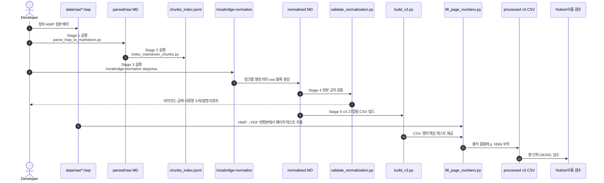

> 🌐 **언어:** **한국어** | [English](README_EN.md)

# Vizabridge Visa RAG

대한민국 **비자·체류 HWP 매뉴얼**을 챗봇/RAG에 넣기 전, 사람이 원본과 대조해 검수할 수 있는 **27컬럼 v3 CSV**로 변환하는 데이터 전처리 파이프라인입니다.

이 프로젝트의 관점은 단순합니다. 비자 매뉴얼은 "문서"가 아니라 **행정 규칙 데이터베이스**입니다. 그래서 PDF/HWP를 통째로 임베딩하지 않고, 비자코드·신청종류·대상자·자격요건·제출서류·제한·예외·출처 페이지를 분리해 검수 가능한 행으로 컴파일합니다.


## 30초 요약

| 항목 | 내용 |
| --- | --- |
| 원본 | `data/raw/*.hwp` 정부 HWP 매뉴얼 |
| 중간 표현 | `data/parsed/normalized/{stay,visa}_manual.md` |
| 최종 산출물 | `data/processed/{체류,사증}매뉴얼_검수용_v3.csv` |
| 행 단위 | `(비자코드 × 신청종류)` 1조합 |
| 스키마 | 27컬럼 v3 CSV |
| LLM 사용 | Stage 3 정규화 1회 |
| 결정적 처리 | HWP 변환, 청크 분할, 검증, CSV 빌드, 페이지 매핑 |
| 현재 행 수 | 체류 233행, 사증 130행 |
| 페이지 출처 | 모든 행의 `출처` 컬럼에 `p. NNN` 또는 `p. NNN~MMM` 형식으로 부착 |

## 왜 이렇게 만들었나

한국 비자 매뉴얼은 보통 아래처럼 생겼습니다.



한 비자코드 안에도 여러 민원 유형이 섞입니다. 예를 들어 `F-6` 결혼이민 하나만 봐도 사증발급, 체류자격 변경, 체류기간 연장, 체류자격 부여처럼 검수 기준이 다른 신청종류가 존재합니다. 이걸 한 셀에 몰아넣으면 다음 문제가 생깁니다.

- 검수자가 "이 행이 맞다/틀리다"를 판단하기 어렵습니다.
- RAG가 사증발급 요건과 체류기간 연장 서류를 섞어 답할 수 있습니다.
- 페이지 출처가 넓어져 원문 대조 비용이 커집니다.
- 스키마 변경 때 LLM을 다시 돌려야 하는 비용이 커집니다.

그래서 최종 CSV는 **행 = 하나의 행정 판단 단위**로 설계했습니다. `(비자코드 × 신청종류)`를 기준으로 쪼개고, 각 행 안에서 대상자·요건·서류·제한·예외·출처를 별도 컬럼으로 나눕니다.

## 파이프라인


핵심 원칙은 **LLM은 의미 정규화만 담당하고, 나머지는 결정적 Python으로 재현 가능하게 처리한다**는 것입니다.



### 단계별 산출물

| Stage | 처리 | 도구 | 입력 | 출력 |
| --- | --- | --- | --- | --- |
| 1 | HWP를 Markdown으로 변환 | `scripts/parse_hwp_to_markdown.py`, kordoc | `data/raw/*.hwp` | `data/parsed/raw/*.md` |
| 2 | 표 경계 기준 청크 분할 | `scripts/index_markdown_chunks.py` | raw Markdown | `data/parsed/chunks/*.jsonl` |
| 3 | 행정 의미 단위 정규화 | `/vizabridge-normalize` Claude Code 스킬 | chunk index | `data/parsed/normalized/*.md` |
| 4 | 원본 대조 검증 | `scripts/validate_normalization.py` | normalized MD + raw MD | `data/parsed/validation/*.json` |
| 5 | 27컬럼 CSV 생성 | `scripts/build_v3.py` | normalized MD | `data/processed/*_검수용_v3.csv` |
| 6 | PDF 페이지 fuzzy 매칭 | `scripts/fill_page_numbers.py` | v3 CSV + PDF | `출처` 페이지 보강 CSV |

## 27컬럼 설계


v3 스키마는 "챗봇이 읽기 좋은 데이터"이기 전에 **검수자가 원본 옆에서 틀린 부분을 빠르게 찾는 데이터**입니다. 그래서 컬럼을 넓게 펼쳤습니다.

| 그룹 | 컬럼 수 | 컬럼 |
| --- | ---: | --- |
| 식별·분류 | 4 | `비자코드`, `상위코드`, `사증·체류`, `신청종류` |
| 행정 내용 | 14 | `신청상황`, `대상자`, `자격요건`, `절차`, `수수료`, `기간`, `제한`, `예외`, `의무사항`, `점수표`, `쿼터`, `초청자`, `추천·승인기관`, `표 데이터` |
| 자료 | 2 | `제출서류`, `예상질문` |
| 출처 | 1 | `출처` |
| 흐름·검색 | 4 | `선행자격`, `다음단계`, `동반가족`, `키워드` |
| 검수 | 2 | `검수상태`, `검수메모` |

스키마 원본은 [docs/diagrams/v3_schema.dbml](docs/diagrams/v3_schema.dbml)에 있습니다. dbdiagram.io에 붙여 넣으면 ERD로 볼 수 있고, 렌더링된 이미지는 아래 파일입니다.


### 컬럼을 나눈 이유

| 설계 결정 | 이유 |
| --- | --- |
| `(비자코드 × 신청종류)`를 행 단위로 사용 | 같은 비자코드 안에서도 사증발급·자격변경·기간연장은 요건과 서류가 다릅니다. 행을 나눠야 검수와 검색이 안정적입니다. |
| `자격요건`, `제출서류`, `제한`, `예외`를 분리 | RAG 답변에서 "할 수 있음"과 "할 수 없음", "필수"와 "예외"가 섞이면 위험합니다. |
| `출처`에 페이지를 붙임 | 검수자가 한 컬럼만 보고 원본 PDF/HWP 페이지로 바로 이동할 수 있습니다. |
| `선행자격`, `다음단계`, `동반가족`, `키워드`를 별도 보강 | 사용자는 비자코드를 모르는 경우가 많기 때문에 자연어 검색과 라우팅에 필요한 힌트를 미리 제공합니다. |
| `검수상태`, `검수메모`를 CSV에 포함 | Notion으로 가져간 뒤 별도 DB 설계 없이 바로 검수 워크플로를 만들 수 있습니다. |

## 빠른 시작

```bash
python3 -m venv .venv
source .venv/bin/activate
pip install -r requirements.txt

# kordoc 실행에 Node.js 18+ 필요
node --version
```

새 매뉴얼을 처음부터 처리할 때:

```bash
# Stage 1~2: HWP → Markdown → chunk index
python scripts/parse_hwp_to_markdown.py
python scripts/index_markdown_chunks.py

# Stage 3: Claude Code 세션에서 LLM 정규화
# /vizabridge-normalize stay
# /vizabridge-normalize visa

# Stage 4~5: 검증 후 v3 CSV 생성
python scripts/validate_normalization.py
python scripts/build_v3.py

# Stage 6: HWP→PDF 변환 후 페이지 매핑
soffice --headless --convert-to pdf --outdir data/raw/pdf/ data/raw/*.hwp
python scripts/fill_page_numbers.py
```

페이지 텍스트 캐시를 무시하고 다시 매칭할 때:

```bash
python scripts/fill_page_numbers.py both --force
```

## 재실행 기준

| 상황 | 다시 실행할 단계 |
| --- | --- |
| HWP 원본이 바뀜 | Stage 1부터 전체 재실행 |
| 정규화 규칙만 고침 | Stage 3부터 재실행 |
| v3 컬럼 매핑만 고침 | Stage 5부터 재실행 |
| 페이지 번호만 틀림 | Stage 6만 재실행 |
| 검수자가 CSV에서 오타를 발견 | normalized MD 또는 빌더 규칙을 수정한 뒤 Stage 4~6 재실행 |

정규화 Markdown을 커밋하는 이유가 여기 있습니다. `data/parsed/normalized/*.md`가 안정적인 중간 표현이므로, CSV 컬럼이나 페이지 매핑을 바꿀 때 LLM을 반복 호출하지 않아도 됩니다.

## 페이지 매핑 방식

HWP 본문은 source of truth이고, 페이지 번호는 검수 편의를 위해 HWP를 PDF로 변환한 뒤 가져옵니다.

1. LibreOffice와 H2Orestart로 HWP를 PDF로 변환
2. `pdfplumber`로 페이지별 텍스트 추출
3. PDF 텍스트를 NFC 정규화, 구두점 제거, 한글 중복 글자 압축으로 정리
4. CSV 행의 핵심 컬럼에서 후보 텍스트 생성
5. 50자, 30자, 18자 sliding window로 PDF 페이지 텍스트와 fuzzy 매칭
6. 직전 행 페이지를 hint로 사용해 인접 페이지에 가중치 부여
7. 여러 페이지에 걸친 행은 `p. 442~444`처럼 범위로 표시

현재 v3 CSV 기준 페이지 매칭률:

| 매뉴얼 | 행 수 | 페이지 매칭 |
| --- | ---: | ---: |
| 체류 | 233 | 100% |
| 사증 | 130 | 100% |

## 검수 워크플로

검수자는 `data/processed/`의 Notion 검수용 CSV를 가져가 행 단위로 원본과 대조합니다.

1. `체류매뉴얼_노션검수용_v3.csv` 또는 `사증매뉴얼_노션검수용_v3.csv`를 Notion으로 import
2. `검수상태`를 Status 컬럼으로 변경
3. `사증·체류`, `신청종류`, `상위코드`를 Select 컬럼으로 변경
4. `검수상태 = 미검수` 뷰를 만들고 `상위코드` 기준으로 정렬
5. 각 행의 `출처`에 적힌 `p. NNN` 페이지를 원본 PDF/HWP와 대조
6. 검수 완료 시 `검수상태`와 `검수메모` 갱신

## 품질 검증

```bash
python -m pytest tests -q
```

품질 기준:

- 정규화 row의 비자코드, 금액, 서류명이 원본 청크에 실제 등장하는지 확인
- 모든 최종 행에 출처 페이지가 채워졌는지 확인
- F-6, E-7-4, D-2-5, F-5-1, F-2-7, E-9, H-1, F-4 등 핵심 비자 사실 회귀 테스트
- 검수자가 Notion에서 행 단위 OK/NG 판단을 할 수 있는 컬럼 구조 유지

## 디렉토리 구조

```text
.
├── data/
│   ├── raw/                              # HWP 원본과 PDF 변환물
│   ├── parsed/
│   │   ├── raw/                          # kordoc Markdown
│   │   ├── chunks/                       # 청크 인덱스
│   │   ├── normalized/                   # LLM 정규화 결과
│   │   └── validation/                   # validator 결과
│   └── processed/                        # 검수용 v3 CSV
├── docs/
│   ├── diagrams/                         # 아키텍처/스키마 이미지
│   ├── pipeline_strategy.md              # 파이프라인 설계 배경
│   └── project_structure.md              # 폴더 운영 정책
├── scripts/                              # 결정적 Python 파이프라인
├── tests/                                # CSV 품질 회귀 테스트
├── interview/                            # 별도 Next.js 인터뷰 앱
└── requirements.txt
```

스크립트별 상세 설명은 [scripts/README.md](scripts/README.md), 설계 배경은 [docs/pipeline_strategy.md](docs/pipeline_strategy.md), 폴더 운영 원칙은 [docs/project_structure.md](docs/project_structure.md)를 참고하세요.

## 개발자 노트

이 저장소는 "문서를 CSV로 변환"하는 프로젝트라기보다, 행정 매뉴얼을 검수 가능한 데이터 모델로 바꾸는 작은 컴파일러에 가깝습니다.

- **Source**: `data/raw/*.hwp`
- **IR**: `data/parsed/normalized/*.md`
- **Compiler passes**: `scripts/*.py`
- **Output**: `data/processed/*_v3.csv`
- **Quality gate**: validator + pytest + Notion 검수

새 컬럼을 추가할 때는 `scripts/build_v3.py`의 `V3_COLUMNS`, `DIRECT_MAP`, `PARENT_FLOW`, `SUB_OVERRIDE`를 먼저 확인하세요. 정규화 스킬이 이미 충분한 의미 필드를 만들고 있다면 LLM을 다시 실행하지 않고 Stage 5부터 재생성할 수 있습니다.
