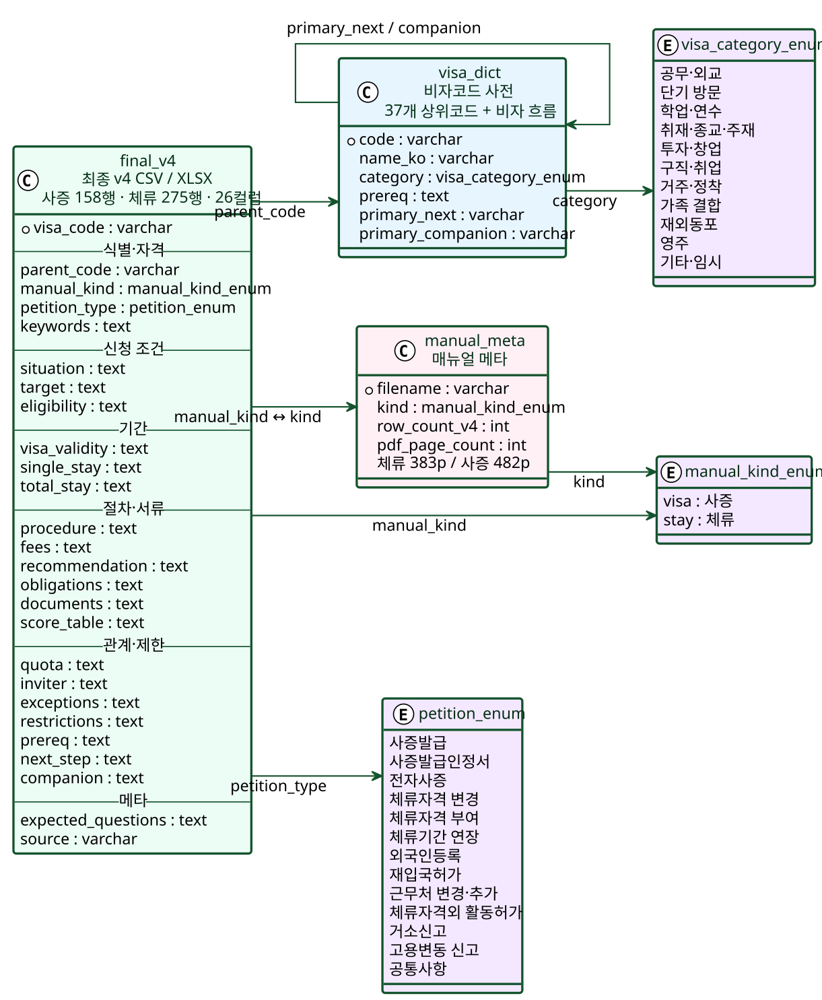

<div align="center">

# Vizabridge

**A data pipeline that compiles Korea's visa & residence-permit manuals into reviewable, structured data**

[]()
[]()
[]()
[]()
[]()
[]()
[](docs/report/Vizabridge_데이터전처리_결과보고서.pdf)

[한국어](README.md) · **English**

</div>

---

## One-line summary

> Compile the 865-page Ministry of Foreign Affairs visa/sojourn manuals into a **26-column CSV/XLSX** (visa 158 rows, stay 275 rows) that a human reviewer can OK/NG one row at a time.
>
> The full design rationale, working principles, and follow-up considerations of this 1st-stage data preprocessing are documented in the [final report PDF](docs/report/Vizabridge_데이터전처리_결과보고서.pdf) (Korean).

---

## Why

Visa manuals are **not documents, they are administrative rule databases**. Throwing the 865-page PDF directly into a RAG store breaks down in several ways:

- Reviewers have no row-level basis to verify a chatbot answer
- Status-change requirements and duration-extension documents get mixed into one answer
- Without page references, users cannot verify against the original
- Re-embedding from scratch every time the manual is revised is wasteful

So we **compile once before embedding**. We split visa code · petition type · eligibility · required documents · restrictions · exceptions · source page into separate columns of a CSV. A human review pass happens on this CSV before it goes downstream to the chatbot/RAG.

---

## Korean visa basics — without this, the column design will not make sense

### 1. Visa vs Sojourn — two manuals exist for a reason

| Stage | Issued by | Where | What it means |
| --- | --- | --- | --- |
| **사증 (Visa)** | Korean embassy/consulate abroad | Outside Korea | "You may enter Korea" — entry permit |
| **체류 (Sojourn)** | Immigration office in Korea | Inside Korea | "You may stay in Korea under code X for N months" — residency right |

Even for the same person under the same visa code (e.g. `F-6`), there are two manuals.

→ The `사증·체류` column in the v4 CSV is the largest partitioning axis between the two manuals.

### 2. Visa codes — meaning of the letter + number

| Letter | Meaning | Examples |
| --- | --- | --- |
| **A** | Diplomatic / official / treaty | A-1, A-2, A-3 |
| **B** | Visa-free / tourist-transit | B-1, B-2 |
| **C** | Short-term (≤ 90 days) | C-1, C-3, C-4 |
| **D** | Study / training / investment / job-seeking | D-2, D-4, D-7, D-8, D-10 |
| **E** | Employment | E-1, E-2, E-7, E-9 |
| **F** | Residence / family / overseas Korean / permanent | F-1, F-3, F-4, F-5, F-6 |
| **G** | Other (refugee, humanitarian, etc.) | G-1 |
| **H** | Working-holiday / overseas-Korean work | H-1, H-2 |

Parent codes ≈ 37. With sub-programs like `E-7-4` or `F-6-1`, the manual reaches **200+ fine-grained statuses**.

### 3. Petition types — one visa, many procedures

A holder of a single visa still needs to visit Immigration multiple times over their stay (issuance, registration, extension, change, etc.). v4 partitions rows by `(visa_code × petition_type)` so that requirements/documents for each step stay separate.

---

## 30-second summary

| Item | Value |
| --- | --- |
| Source | `data/raw/*.hwp` |
| Intermediate representation | `data/parsed/normalized/{stay,visa}_manual.md` |
| Final output | `data/processed/{사증,체류}매뉴얼_최종_v4_26col.csv` + `.xlsx` |
| Row unit | `(visa_code × petition_type)` |
| Schema | **26 columns** (Report §2.1 「26 columns at a glance」 — 6-category grouping) |
| LLM calls | Stage 3 normalization only |
| Deterministic | HWP conversion, chunking, validation, CSV/XLSX build, page mapping |
| Current row counts | **visa 158, stay 275** |
| Page mapping | 100% (every row's `출처` carries `p. NNN`) |
| Report | [`docs/report/Vizabridge_데이터전처리_결과보고서.pdf`](docs/report/Vizabridge_데이터전처리_결과보고서.pdf) |

---

## Pipeline

> **Core principle: the LLM only handles semantic normalization. The other 5 stages are deterministic Python, fully reproducible.**

| Stage | Process | Tool | Input | Output |
| --- | --- | --- | --- | --- |
| 1 | HWP → Markdown | `scripts/parse_hwp_to_markdown.py`, kordoc | `data/raw/*.hwp` | `data/parsed/raw/*.md` |
| 2 | Chunk split on table boundaries | `scripts/index_markdown_chunks.py` | raw MD | `data/parsed/chunks/*.jsonl` |
| 3 | Administrative semantic normalization (incl. merged-row splitting) | `/vizabridge-normalize` Claude Code skill | chunks | `data/parsed/normalized/*.md` |
| 4 | Cross-validation against source | `scripts/validate_normalization.py` | normalized + raw | `data/parsed/validation/*.json` |
| 5 | v4 CSV + XLSX build | `scripts/build_v4.py` | normalized MD | `data/processed/*_최종_v4_26col.{csv,xlsx}` |
| 6 | PDF page fuzzy matching + XLSX sync | `scripts/fill_page_numbers.py` | v4 CSV + PDF | CSV/XLSX with `(p. NNN)` filled |

---

## v4 schema (26 columns)



Source-of-truth: [`docs/diagrams/v4_schema.dbml`](docs/diagrams/v4_schema.dbml). Paste into dbdiagram.io for an interactive ERD.

The 6-category grouping (Report §2.1):

| Category | Count | Columns | Role |
| --- | ---: | --- | --- |
| Identity / status | 5 | `비자코드`, `상위코드`, `사증·체류`, `신청종류`, `키워드` | Row identification & classification |
| Application conditions | 3 | `신청상황`, `대상자`, `자격요건` | Who · when · under what conditions |
| Duration | 3 | `사증유효기간`, `1회부여 체류기간`, `체류상한` | Time units of the visa |
| Procedure / documents | 6 | `절차`, `수수료`, `추천·승인기관`, `의무사항`, `제출서류`, `점수표` | How to process · what to submit |
| Relationships / restrictions | 7 | `쿼터`, `초청자`, `예외`, `제한`, `선행자격`, `다음단계`, `동반가족` | Relationships between statuses |
| Meta | 2 | `예상질문`, `출처` | Search & verification metadata |

> **v3 → v4 change**: review-workflow columns (`검수상태`, `검수메모`) were removed from the data layer (v3 had 28 columns). Reviewers add a Status column after importing into Notion. Data layer and review/presentation layer are now separated.

---

## Quick start

```bash
python3 -m venv .venv
source .venv/bin/activate
pip install -r requirements.txt
node --version    # Node.js 18+ for kordoc
```

### Process a new manual from scratch

```bash
# Stage 1·2 — HWP → Markdown → chunks
python scripts/parse_hwp_to_markdown.py
python scripts/index_markdown_chunks.py

# Stage 3 — inside a Claude Code session
#   /vizabridge-normalize stay
#   /vizabridge-normalize visa

# Stage 4·5 — validate + v4 CSV/XLSX
python scripts/validate_normalization.py
python scripts/build_v4.py

# Stage 6 — HWP → PDF → page mapping
brew install --cask libreoffice
curl -L -o /tmp/H2Orestart.oxt \
  https://github.com/ebandal/H2Orestart/releases/latest/download/H2Orestart.oxt
unopkg add /tmp/H2Orestart.oxt
soffice --headless --convert-to pdf --outdir data/raw/pdf/ data/raw/*.hwp
python scripts/fill_page_numbers.py
```

### Page mapping only

```bash
python scripts/fill_page_numbers.py both --force
```

---

## Data quality

```bash
python -m pytest tests -q
```

The tests regression-lock:

- v4 row counts (visa 158 / stay 275) and column count (26)
- Column fill rates at or above Report Appendix B
- Page reference filled on every v4 row
- Eight core facts — F-6 2026 income requirement, E-7-4 200pt / KRW 26M, D-2-5 ≤ 2 years, F-5-1 5 years stay, F-2-7 80 pts, E-9 16 source countries, H-1 age 18–30, F-4 unskilled-labor restriction

---

## Directory structure

```text
.
├── data/
│   ├── raw/                       # HWP source, PDF conversion (gitignored)
│   ├── parsed/
│   │   ├── raw/                   # kordoc Markdown
│   │   ├── chunks/                # chunk index
│   │   ├── normalized/            # LLM normalized output (committed)
│   │   └── validation/            # validator output
│   └── processed/                 # final v4 CSV/XLSX
├── docs/
│   ├── diagrams/                  # architecture + schema images (v4_schema.dbml/svg)
│   ├── report/                    # final result report (PDF)
│   ├── pipeline_strategy.md       # pipeline design rationale
│   └── project_structure.md       # folder operating policy
├── scripts/                       # deterministic Python pipeline (6 stage)
├── tests/                         # regression tests for CSV quality
├── .claude/skills/                # Claude Code normalization/repair skills
├── .agents/skills/                # mirror of the skills for codex/copilot
├── interview/                     # separate Next.js interview app (unrelated)
└── requirements.txt
```

More documents:

- 1st-stage preprocessing report (final) → [`docs/report/Vizabridge_데이터전처리_결과보고서.pdf`](docs/report/Vizabridge_데이터전처리_결과보고서.pdf)
- Per-script usage → [`scripts/README.md`](scripts/README.md)
- Pipeline design rationale → [`docs/pipeline_strategy.md`](docs/pipeline_strategy.md)
- Folder operating policy → [`docs/project_structure.md`](docs/project_structure.md)
- DBML schema → [`docs/diagrams/v4_schema.dbml`](docs/diagrams/v4_schema.dbml)

---

## License

Internal project (Hellofriends · Vizabridge data preprocessing team). The manual source is public material from the Ministry of Justice.
